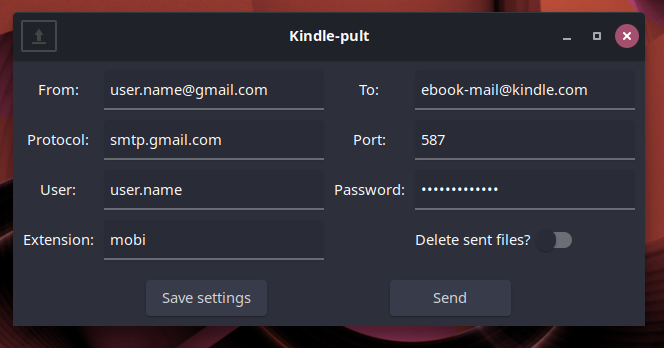

# Kindle-pult

Catapult your e-books to Kindle and other e-book readers.

Kindle-pult is open source and released under GPL license. It's purpose is to make easier to send files from your desktop to your e-reader. The name
recalls _Kindle_ just because I made the app with my Kindle in mind.

Kindle-pult is a full Rust/GTK graphical wrapper around Calibre CLI functions, so it will not work without Calibre and Python on your machine.

## Install

[Download for Linux](#) (Ubuntu tested)

[Download for Windows](#)  (TODO)

Compile it yourself:

`git clone https://github.com/mr-chrome/kindle-pult.git`

`cd kindle-pult`

`cargo build --release`

## TODOs

- Add "About" section;
- Progress bar for process;
- Dialogs for process end;
- Download and send articles/documents with URL;
